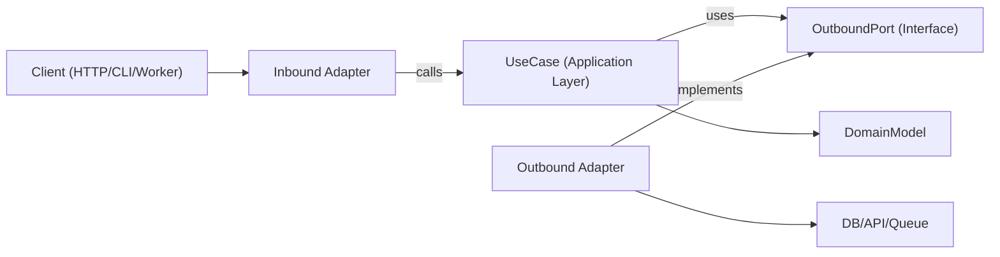

# Hexagonal Architecture

ヘキサゴナルアーキテクチャ（Ports and Adapters）は、ビジネスロジックをフレームワーク、トランスポート、永続化の詳細から独立させます。コアアプリケーションは抽象的なポートに依存し、アダプターがエッジ部分でそれらのポートを実装します。

## 使用タイミング

- 長期的な保守性とテスタビリティが重要な新機能を構築する場合。
- ドメインロジックが I/O 関連の処理と混在しているレイヤード構造やフレームワーク依存の強いコードをリファクタリングする場合。
- 同一のユースケースに対して複数のインターフェースをサポートする場合（HTTP、CLI、キューワーカー、cronジョブ）。
- ビジネスルールを書き換えずにインフラ（データベース、外部API、メッセージバス）を置き換える場合。

リクエストが境界、ドメイン中心の設計、密結合サービスのリファクタリング、または特定のライブラリからのアプリケーションロジックの分離に関わる場合にこのスキルを使用してください。

## コアコンセプト

- **ドメインモデル**: ビジネスルールとエンティティ/値オブジェクト。フレームワークのインポートなし。
- **ユースケース（アプリケーション層）**: ドメインの振る舞いとワークフローステップをオーケストレーションします。
- **インバウンドポート**: アプリケーションが何を行えるかを記述するコントラクト（コマンド/クエリ/ユースケースインターフェース）。
- **アウトバウンドポート**: アプリケーションが必要とする依存関係のコントラクト（リポジトリ、ゲートウェイ、イベントパブリッシャー、クロック、UUID など）。
- **アダプター**: ポートのインフラおよびデリバリー実装（HTTPコントローラー、DBリポジトリ、キューコンシューマー、SDKラッパー）。
- **コンポジションルート**: 具体的なアダプターをユースケースにバインドする単一の配線場所。

アウトバウンドポートインターフェースは通常アプリケーション層に配置されます（抽象化が真にドメインレベルの場合のみドメイン層に配置）。一方、インフラアダプターがそれらを実装します。

依存関係の方向は常に内向きです:

- アダプター -> アプリケーション/ドメイン
- アプリケーション -> ポートインターフェース（インバウンド/アウトバウンドコントラクト）
- ドメイン -> ドメインのみの抽象化（フレームワークやインフラの依存関係なし）
- ドメイン -> 外部への依存なし

## 仕組み

### ステップ 1: ユースケース境界をモデル化する

明確な入出力 DTO を持つ単一のユースケースを定義します。トランスポートの詳細（Express の `req`、GraphQL の `context`、ジョブペイロードラッパー）はこの境界の外に保ちます。

### ステップ 2: まずアウトバウンドポートを定義する

すべての副作用をポートとして特定します:

- 永続化（`UserRepositoryPort`）
- 外部呼び出し（`BillingGatewayPort`）
- 横断的関心事（`LoggerPort`、`ClockPort`）

ポートはテクノロジーではなく、ケイパビリティをモデル化すべきです。

### ステップ 3: 純粋なオーケストレーションとしてユースケースを実装する

ユースケースのクラス/関数はコンストラクタ/引数を介してポートを受け取ります。アプリケーションレベルの不変条件を検証し、ドメインルールを調整し、プレーンなデータ構造を返します。

### ステップ 4: エッジにアダプターを構築する

- インバウンドアダプターはプロトコル入力をユースケース入力に変換します。
- アウトバウンドアダプターはアプリケーションのコントラクトを具体的な API/ORM/クエリビルダーにマッピングします。
- マッピングはユースケース内部ではなくアダプター内に留めます。

### ステップ 5: コンポジションルートですべてを配線する

アダプターをインスタンス化し、ユースケースに注入します。この配線を集中化して、隠れたサービスロケーターの振る舞いを避けます。

### ステップ 6: 境界ごとにテストする

- フェイクポートを使ってユースケースをユニットテストします。
- 実際のインフラ依存関係を使ってアダプターを統合テストします。
- インバウンドアダプターを通じてユーザー向けフローを E2E テストします。

## アーキテクチャ図



## 推奨モジュールレイアウト

明確な境界を持つフィーチャーファーストの構成を使用します:

```text
src/
  features/
    orders/
      domain/
        Order.ts
        OrderPolicy.ts
      application/
        ports/
          inbound/
            CreateOrder.ts
          outbound/
            OrderRepositoryPort.ts
            PaymentGatewayPort.ts
        use-cases/
          CreateOrderUseCase.ts
      adapters/
        inbound/
          http/
            createOrderRoute.ts
        outbound/
          postgres/
            PostgresOrderRepository.ts
          stripe/
            StripePaymentGateway.ts
      composition/
        ordersContainer.ts
```

## TypeScript の例

### ポート定義

```typescript
export interface OrderRepositoryPort {
  save(order: Order): Promise<void>;
  findById(orderId: string): Promise<Order | null>;
}

export interface PaymentGatewayPort {
  authorize(input: { orderId: string; amountCents: number }): Promise<{ authorizationId: string }>;
}
```

### ユースケース

```typescript
type CreateOrderInput = {
  orderId: string;
  amountCents: number;
};

type CreateOrderOutput = {
  orderId: string;
  authorizationId: string;
};

export class CreateOrderUseCase {
  constructor(
    private readonly orderRepository: OrderRepositoryPort,
    private readonly paymentGateway: PaymentGatewayPort
  ) {}

  async execute(input: CreateOrderInput): Promise<CreateOrderOutput> {
    const order = Order.create({ id: input.orderId, amountCents: input.amountCents });

    const auth = await this.paymentGateway.authorize({
      orderId: order.id,
      amountCents: order.amountCents,
    });

    // markAuthorized は新しい Order インスタンスを返します。その場での変更はしません。
    const authorizedOrder = order.markAuthorized(auth.authorizationId);
    await this.orderRepository.save(authorizedOrder);

    return {
      orderId: order.id,
      authorizationId: auth.authorizationId,
    };
  }
}
```

### アウトバウンドアダプター

```typescript
export class PostgresOrderRepository implements OrderRepositoryPort {
  constructor(private readonly db: SqlClient) {}

  async save(order: Order): Promise<void> {
    await this.db.query(
      "insert into orders (id, amount_cents, status, authorization_id) values ($1, $2, $3, $4)",
      [order.id, order.amountCents, order.status, order.authorizationId]
    );
  }

  async findById(orderId: string): Promise<Order | null> {
    const row = await this.db.oneOrNone("select * from orders where id = $1", [orderId]);
    return row ? Order.rehydrate(row) : null;
  }
}
```

### コンポジションルート

```typescript
export const buildCreateOrderUseCase = (deps: { db: SqlClient; stripe: StripeClient }) => {
  const orderRepository = new PostgresOrderRepository(deps.db);
  const paymentGateway = new StripePaymentGateway(deps.stripe);

  return new CreateOrderUseCase(orderRepository, paymentGateway);
};
```

## 多言語マッピング

エコシステム間で同じ境界ルールを使用します。変わるのは構文と配線スタイルのみです。

- **TypeScript/JavaScript**
  - ポート: `application/ports/*` としてインターフェース/型を定義。
  - ユースケース: コンストラクタ/引数注入によるクラス/関数。
  - アダプター: `adapters/inbound/*`、`adapters/outbound/*`。
  - コンポジション: 明示的なファクトリ/コンテナモジュール（隠れたグローバルなし）。
- **Java**
  - パッケージ: `domain`、`application.port.in`、`application.port.out`、`application.usecase`、`adapter.in`、`adapter.out`。
  - ポート: `application.port.*` 内のインターフェース。
  - ユースケース: プレーンクラス（Spring の `@Service` はオプション、必須ではない）。
  - コンポジション: Spring 設定または手動配線クラス。配線をドメイン/ユースケースクラスの外に保つ。
- **Kotlin**
  - モジュール/パッケージは Java の分割をミラーリング（`domain`、`application.port`、`application.usecase`、`adapter`）。
  - ポート: Kotlin インターフェース。
  - ユースケース: コンストラクタ注入によるクラス（Koin/Dagger/Spring/手動）。
  - コンポジション: モジュール定義または専用のコンポジション関数。サービスロケーターパターンを避ける。
- **Go**
  - パッケージ: `internal/<feature>/domain`、`application`、`ports`、`adapters/inbound`、`adapters/outbound`。
  - ポート: 消費側のアプリケーションパッケージが所有する小さなインターフェース。
  - ユースケース: インターフェースフィールドを持つ構造体と明示的な `New...` コンストラクタ。
  - コンポジション: `cmd/<app>/main.go`（または専用の配線パッケージ）で配線し、コンストラクタは明示的に保つ。

## 避けるべきアンチパターン

- ドメインエンティティが ORM モデル、Web フレームワーク型、または SDK クライアントをインポートすること。
- ユースケースが `req`、`res`、またはキューメタデータから直接読み取ること。
- ドメイン/アプリケーションマッピングなしにユースケースからデータベース行を直接返すこと。
- ユースケースポートを経由せずにアダプター同士が直接呼び出し合うこと。
- 隠れたグローバルシングルトンを持つ多数のファイルに依存関係の配線を分散させること。

## 移行プレイブック

1. 変更の痛みが頻繁に発生する1つの垂直スライス（単一のエンドポイント/ジョブ）を選択します。
2. 明示的な入出力型を持つユースケース境界を抽出します。
3. 既存のインフラ呼び出しの周りにアウトバウンドポートを導入します。
4. コントローラー/サービスからユースケースにオーケストレーションロジックを移動します。
5. 旧アダプターを維持しますが、新しいユースケースに処理を委譲させます。
6. 新しい境界の周りにテストを追加します（ユニット + アダプター統合）。
7. スライスごとに繰り返します。全面的な書き直しは避けてください。

### 既存システムのリファクタリング

- **ストラングラーアプローチ**: 現行のエンドポイントを維持し、一度に1つのユースケースを新しいポート/アダプターを通してルーティングします。
- **ビッグバン書き換えは行わない**: フィーチャースライスごとに移行し、特性テストで振る舞いを保持します。
- **まずファサード**: 内部を置き換える前に、レガシーサービスをアウトバウンドポートの背後にラップします。
- **コンポジションフリーズ**: 配線を早期に集中化し、新しい依存関係がドメイン/ユースケース層に漏れないようにします。
- **スライス選択ルール**: 変更頻度が高く、影響範囲が小さいフローを優先します。
- **ロールバックパス**: 本番環境での振る舞いが確認されるまで、移行されたスライスごとに可逆的なトグルまたはルートスイッチを維持します。

## テストガイダンス（同じヘキサゴナル境界）

- **ドメインテスト**: エンティティ/値オブジェクトを純粋なビジネスルールとしてテストします（モックなし、フレームワークセットアップなし）。
- **ユースケースユニットテスト**: アウトバウンドポートのフェイク/スタブを使ってオーケストレーションをテストし、ビジネス成果とポートのインタラクションをアサートします。
- **アウトバウンドアダプターコントラクトテスト**: ポートレベルで共有コントラクトスイートを定義し、各アダプター実装に対して実行します。
- **インバウンドアダプターテスト**: プロトコルマッピング（HTTP/CLI/キューペイロードからユースケース入力への変換、および出力/エラーのプロトコルへの逆マッピング）を検証します。
- **アダプター統合テスト**: シリアライゼーション、スキーマ/クエリの振る舞い、リトライ、タイムアウトのために実際のインフラ（DB/API/キュー）に対して実行します。
- **エンドツーエンドテスト**: インバウンドアダプター -> ユースケース -> アウトバウンドアダプターを通じて重要なユーザージャーニーをカバーします。
- **リファクタリングの安全性**: 抽出前に特性テストを追加し、新しい境界の振る舞いが安定して等価になるまでそれらを維持します。

## ベストプラクティスチェックリスト

- ドメインとユースケース層は内部型とポートのみをインポートします。
- すべての外部依存関係はアウトバウンドポートで表現されます。
- バリデーションは境界で行います（インバウンドアダプター + ユースケースの不変条件）。
- イミュータブルな変換を使用します（共有状態を変更する代わりに新しい値/エンティティを返す）。
- エラーは境界を跨いで変換されます（インフラエラー -> アプリケーション/ドメインエラー）。
- コンポジションルートは明示的で監査しやすいものにします。
- ユースケースはポートのシンプルなインメモリフェイクでテスト可能です。
- リファクタリングは振る舞いを保持するテストを伴う1つの垂直スライスから開始します。
- 言語/フレームワーク固有の事項はアダプターに留め、ドメインルールには入れません。
